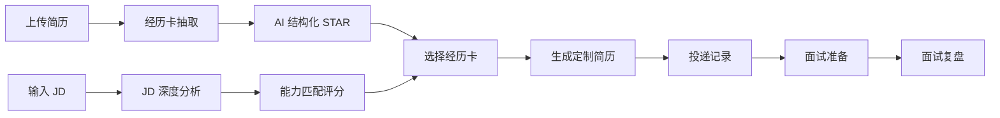

<div align="center">

# 🎯 JobCraft 求职助手

> AI 驱动的全流程求职管理系统 —— 从经历沉淀、JD 分析到面试复盘的智能伴侣


</div>

---

## 📸 界面预览

> 在 `screenshots/` 目录放置截图后，替换下方图片引用即可。
> 推荐尺寸：**1280×720**，PNG 格式。

| 求职仪表盘 | 经历卡管理 | JD 深度分析 |
|:---:|:---:|:---:|
| `` | `` | `` |

| 定制简历 | 面试准备 | 面试复盘 |
|:---:|:---:|:---:|
| `` | `` | `` |

> 💡 **生成截图的小技巧**：启动项目后访问 `http://localhost`，用浏览器 DevTools 的设备模拟器（1280px 宽）截图，保存到 `screenshots/` 目录。

---

## ✨ 功能特性

- **📋 经历卡管理** — 上传简历自动解析为结构化经历卡（STAR 结构），支持手动编辑与 AI 润色
- **🔍 JD 深度分析** — 智能解析岗位要求，生成 ATS 关键词覆盖率、能力差距报告与推荐经历
- **📄 定制简历生成** — 根据岗位要求自动匹配经历卡，一键生成定制化 Markdown / HTML 简历
- **🎤 面试准备** — 结合 JD 与经历卡按维度预测面试题，生成答题要点与参考话术
- **📝 面试复盘** — 上传面试录音/文本，AI 自动拆分 QA 对并生成结构化复盘报告
- **📊 求职仪表盘** — 统一管理投递记录，追踪「JD 分析 → 经历匹配 → 简历 → 面试」全流程进度

---

## 🚀 在线体验

本项目为**自托管应用**，AI 能力依赖你自己的 LLM API Key，因此不提供公共 Demo 服务器。

👇 两种方式快速体验：

### 方式一：Docker Compose 一键启动（推荐）

```bash
# 1. 克隆项目
git clone https://github.com/Frangipanelu/jobcraft.git
cd jobcraft

# 2. 配置环境变量
cp .env.example .env
#   编辑 .env，填入你的 OpenAI 兼容接口 API Key（支持 OpenAI / 通义 / DeepSeek / GLM 等任意兼容服务）

# 3. 一键启动全部服务（mysql / redis / backend / frontend / worker）
cd docker
docker compose up -d --build

# 4. 访问应用
open http://localhost          # 前端界面
open http://localhost:8000/docs  # 后端 API 文档
```

> ⏱️ 首次启动约需 1-3 分钟（构建镜像 + 等待 MySQL 健康检查）。

### 方式二：本地开发模式

```bash
# 后端
uv sync
uv run uvicorn app.api.server:app --reload --port 8000

# 前端（另开终端）
cd frontend-jobcraft
npm install
npm run dev
```

---

## 🏗️ 技术栈

| 层级 | 技术 |
|------|------|
| 后端 | Python 3.12 · FastAPI · LangGraph · SQLAlchemy |
| 前端 | React 18 · TypeScript · Vite · Ant Design |
| 数据库 | MySQL 8.4 · Redis 7 |
| AI | 任意 OpenAI 兼容接口（OpenAI / GLM / DeepSeek / 通义等） |
| 异步任务 | Celery Worker（Redis 队列） |
| 部署 | Docker Compose · Nginx |

---

## 📁 项目结构

```
jobcraft/
├── app/                     # 后端主代码
│   ├── api/                 # FastAPI 路由（job_analysis / experience / interview ...）
│   ├── agents/              # AI Agent 节点（JdAtsAgent / GapPolishAgent ...）
│   ├── core/                # LLM 初始化、Prompt 管理
│   ├── schemas/             # Pydantic 数据模型
│   ├── tasks/               # 异步任务（Celery Worker）
│   ├── tools/               # 业务工具（DB / 简历生成 / 文件解析 ...）
│   └── workflows/           # LangGraph 工作流（拆分为可测节点）
├── frontend-jobcraft/       # React 前端
│   └── src/
│       ├── api/             # 后端 API 调用封装
│       ├── components/      # 业务组件（jd / experiences / interview ...）
│       ├── context/         # React Context 全局状态
│       └── types/           # TypeScript 类型定义
├── docker/                  # Dockerfile + docker-compose + nginx
├── prompts/                 # 版本化的 LLM Prompt 模板
├── migrations/              # SQL 迁移脚本
├── tests/                   # 单元测试（pytest）
└── pyproject.toml           # Python 依赖（uv 管理）
```

---

## 🔄 核心数据流



---

## 🧰 环境变量

| 变量 | 说明 | 默认值 |
|------|------|--------|
| `OPENAI_API_KEY` | LLM API Key（必需，任意 OpenAI 兼容服务商） | - |
| `OPENAI_BASE_URL` | OpenAI 兼容端点，可替换为任意服务商 | 参考 `.env.example` |
| `LLM_model` | 模型名称（根据服务商配置） | - |
| `JWT_SECRET_KEY` | JWT 签名密钥（生产必改） | - |
| `MYSQL_*` | MySQL 连接配置 | 见下方 |
| `TAVILY_API_KEY` | Tavily 搜索（面试公司调研） | 可选 |

完整配置见 [.env.example](.env.example)。

---

## 🛠️ 开发规范

### 代码质量检查

```bash
# 后端
uv run ruff check --fix .
uv run ruff format .
uv run pytest tests/ -q

# 前端
cd frontend-jobcraft && npm run build
```

### Commit 规范

```
feat:    新功能
fix:     修复 bug
refactor: 重构
docs:    文档更新
chore:   杂项
```

---

## 🤝 贡献

欢迎提交 Issue 与 Pull Request。开发前请阅读：

- [`docs/engineering-development-workflow-v1.md`](docs/engineering-development-workflow-v1.md) — 工程开发流程
- [`.github/workflows/`](.github/workflows/) — CI 配置（后端 ruff + pytest / 前端 tsc + build）

---

## 📄 License

[MIT](LICENSE)