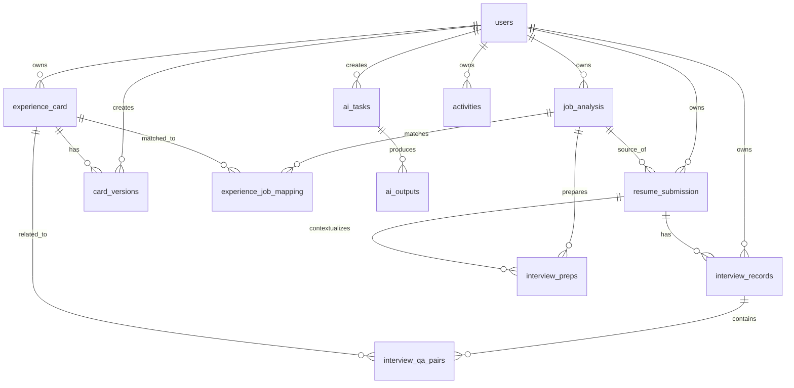

# JobCraft Domain Model v2 + Database Schema v2

> **版本**：v2.0  
> **定位**：前端优先（Frontend-first）+ 复用现有后端（Backend-first integration）  
> **当前数据库实现**：MySQL 8.4  
> **逻辑模型**：数据库无关，可后续迁移 PostgreSQL  
> **目标**：在不推倒现有 FastAPI / LangGraph / MySQL 的前提下，把新 `frontend-jobcraft` 的页面能力逐步接到现有后端，并为后续缺失功能预留可扩展模型。
>
> **核心原则**
>
> 1. 先让新前端使用现有接口和现有数据跑通。
> 2. 缺失能力再补后端，不为了"架构漂亮"提前重写。
> 3. 数据库建模以业务事实为中心，不按页面一比一建表。
> 4. AI 结果与用户原始事实分离。
> 5. Experience Version 是可追溯资产。
> 6. Submission / Application 是求职 Pipeline 的核心聚合。
> 7. 状态机由后端掌握，前端只负责呈现。
> 8. 数据库迁移必须可回滚、可逐步上线。
> 9. 新旧 API 可以并存，禁止一次性破坏式迁移。
> 10. AI Workflow、Prompt、模型、缓存、Task 必须可以追溯。

---

# 1. 为什么 v2 不是"重新设计一套数据库"

当前 JobCraft 主仓库已经具备：

```text
React + TypeScript + Vite
        ↓
FastAPI
        ↓
LangGraph / LangChain
        ↓
MySQL 8.4
```

并且当前仓库已经存在：

```text
experience_card
job_analysis
experience_job_mapping
interview_preps
company_research
resume_submission
interview_records
interview_qa_pairs
card_versions
```

同时，新前端 `frontend-jobcraft/src/api.ts` 已经调用这些真实接口。

因此本设计采用：

```text
                    Existing System
                         │
                         ▼
                Contract Alignment
                         │
            ┌────────────┼────────────┐
            ▼            ▼            ▼
         Frontend       API        Database
                         │
                         ▼
                    Domain v2
                         │
                         ▼
                 Incremental Migration
```

而不是：

```text
旧系统
 ↓
全部删除
 ↓
重新开发
```

---

# 2. Domain Model v2 总览

JobCraft 的核心领域建议最终收敛为：

```text
User
 │
 ├── ExperienceCard
 │       └── ExperienceCardVersion
 │
 ├── JobOpportunity
 │       └── JobDescription
 │               └── JobAnalysis
 │
 ├── Submission / Application
 │       ├── ResumeVersion
 │       ├── UsedExperienceVersions
 │       ├── Interview
 │       │     └── InterviewPreparation
 │       │           └── InterviewQuestion
 │       └── InterviewReview
 │              ├── Transcript
 │              ├── QA Pairs
 │              ├── Question Analyses
 │              └── Experience Feedback
 │
 ├── HistoricalResume / File
 │
 └── Activity
```

AI 横切所有领域：

```text
AI Task
 ├── feature
 ├── business object
 ├── model
 ├── prompt version
 ├── schema version
 ├── cache key
 ├── usage
 └── output
```

---

# 3. 核心业务关系

## 3.1 Experience 是用户的长期资产

```text
ExperienceCard
    │
    ├── 原始事实
    ├── AI Structured Cache
    ├── Tags
    └── Versions
```

核心原则：

```text
用户事实
    ≠
AI 理解
```

AI 可以更新：

```text
ai_structured
```

但不应该覆盖：

```text
raw_text
```

---

## 3.2 Job 是岗位机会

```text
JobOpportunity
    │
    └── JobDescription
            │
            └── JobAnalysis
```

Job 描述岗位机会。

JobDescription 描述某一版 JD 原文。

JobAnalysis 描述一次分析快照。

---

## 3.3 Submission 是 Pipeline 核心

```text
JobOpportunity
      │
      ▼
JobAnalysis
      │
      ▼
Submission
```

Submission 表示：

> 用户针对某个求职机会进行的一次具体投递行为。

因此：

```text
Submission
 ├── 使用哪个 JD
 ├── 使用哪些 Experience Version
 ├── 使用哪份 Resume
 ├── 什么状态
 ├── 什么时候投递
 └── 后续经历多少轮面试
```

---

## 3.4 Interview 属于 Submission

推荐：

```text
Submission
  └── Interview
```

而不是：

```text
Job
  └── Interview
```

因为用户真正经历的是：

```text
某一次投递
 ↓
一面
 ↓
二面
 ↓
Offer
```

同一个 Job Opportunity 理论上可以存在多个 Submission。

---

# 4. 状态机

## 4.1 Submission Status

内部值统一使用英文枚举：

```text
APPLIED
INVITED
ROUND_1
ROUND_2
OFFER
CLOSED
```

前端显示：

```text
APPLIED   → 已投递
INVITED   → 面试邀约
ROUND_1   → 一面
ROUND_2   → 二面
OFFER     → Offer
CLOSED    → 已关闭
```

不要让前端和数据库散落中文业务状态。

---

## 4.2 合法状态流转

```text
APPLIED
   │
   ▼
INVITED
   │
   ▼
ROUND_1
   │
   ▼
ROUND_2
   │
   ├───────────────┐
   ▼               ▼
OFFER            CLOSED
```

允许用户根据真实情况提前关闭：

```text
APPLIED → CLOSED
INVITED → CLOSED
ROUND_1 → CLOSED
ROUND_2 → CLOSED
```

---

## 4.3 面试准备与复盘规则

建议后端业务规则：

```text
can_prepare_interview:
  APPLIED ❌
  INVITED ✅
  ROUND_1 ✅
  ROUND_2 ✅
  OFFER   ❌
  CLOSED  ❌
```

复盘：

```text
can_review_interview:
  APPLIED ❌
  INVITED ❌
  ROUND_1 ✅
  ROUND_2 ✅
  OFFER   ✅
  CLOSED  ✅
```

第一版实现时可以根据实际业务调整，但必须由 Domain Service 统一判断。

---

# 5. 实体清单

| Domain | Entity | 当前数据库 | v2 状态 |
|---|---|---|---|
| User | User | 缺失/隐式 | P0 |
| User | UserPreference | 缺失 | P1 |
| Experience | ExperienceCard | `experience_card` | 保留 |
| Experience | CardVersion | `card_versions` | 保留 + 增强 |
| Job | JobAnalysis | `job_analysis` | 保留 |
| Job | JobDescription | 暂并入 `job_analysis.jd_text` | 后续拆分 |
| Job | ExperienceJobMapping | `experience_job_mapping` | 保留 |
| Submission | Submission | `resume_submission` | 保留 + 语义升级 |
| Resume | ResumeVersion | 暂并入 Submission | P1 |
| Interview | Interview | `interview_records` | 保留 + 语义升级 |
| Interview | InterviewPreparation | `interview_preps` | 保留 |
| Interview | InterviewQuestion | JSON / QA 表 | 逐步拆分 |
| Review | InterviewReview | `interview_records.analysis_json` | 保留后拆 |
| Review | InterviewQAPair | `interview_qa_pairs` | 保留 |
| Company | CompanyResearch | `company_research` | 保留 |
| AI | AITask | 缺失 | P1 |
| AI | AIOutput | 缺失 | P1 |
| AI | AIUsage | 缺失 | P2 |
| Core | Activity | 缺失/前端派生 | P1 |
| File | FileObject | 本地 path | P2 |

---

# 6. 现有数据库 → Domain v2 映射

```text
experience_card
      ↓
ExperienceCard

card_versions
      ↓
ExperienceCardVersion

job_analysis
      ↓
JobAnalysis

experience_job_mapping
      ↓
JobAnalysisExperienceMatch

resume_submission
      ↓
Submission

interview_preps
      ↓
InterviewPreparation

interview_records
      ↓
Interview + InterviewReview

interview_qa_pairs
      ↓
InterviewQAPair

company_research
      ↓
CompanyResearch
```

---

# 7. Database Schema v2 总体 ER



---

# 8. Table 1：users

当前系统缺少真正稳定的 User 表，部分接口使用 `user_id` 默认值 `1`。

v2 必须正式引入。

```sql
CREATE TABLE users (
    id BIGINT UNSIGNED AUTO_INCREMENT PRIMARY KEY,
    email VARCHAR(255) NOT NULL,
    password_hash VARCHAR(255) NULL,
    name VARCHAR(100) NOT NULL,
    avatar_url VARCHAR(500) NULL,
    role VARCHAR(100) NULL,
    target_salary VARCHAR(100) NULL,
    years_of_experience VARCHAR(50) NULL,
    city VARCHAR(100) NULL,
    summary TEXT NULL,
    created_at TIMESTAMP NOT NULL DEFAULT CURRENT_TIMESTAMP,
    updated_at TIMESTAMP NOT NULL DEFAULT CURRENT_TIMESTAMP
        ON UPDATE CURRENT_TIMESTAMP,
    UNIQUE KEY uk_users_email (email)
);
```

### 说明

P0 不是要求立刻实现注册登录，而是：

```text
现有 user_id=1
        ↓
过渡 User
        ↓
Current User
        ↓
删除客户端 user_id 依赖
```

---

# 9. Table 2：user_preferences

```sql
CREATE TABLE user_preferences (
    id BIGINT UNSIGNED AUTO_INCREMENT PRIMARY KEY,
    user_id BIGINT UNSIGNED NOT NULL,
    target_cities JSON NULL,
    target_companies JSON NULL,
    target_roles JSON NULL,
    created_at TIMESTAMP NOT NULL DEFAULT CURRENT_TIMESTAMP,
    updated_at TIMESTAMP NOT NULL DEFAULT CURRENT_TIMESTAMP
        ON UPDATE CURRENT_TIMESTAMP,

    UNIQUE KEY uk_preferences_user (user_id),
    CONSTRAINT fk_preferences_user
        FOREIGN KEY (user_id) REFERENCES users(id)
);
```

这些字段来源于新前端 User Profile 设计。

---

# 10. Table 3：experience_card

## 当前表

项目已有：

```text
experience_card
```

字段已经支持：

```text
raw_text
tags
ai_structured
company
role
period
source
card_type
version
is_active
```

因此第一阶段不要重建。

---

## v2 建议

```sql
ALTER TABLE experience_card
    ADD INDEX idx_experience_user_updated (user_id, updated_at),
    ADD INDEX idx_experience_user_type (user_id, card_type);
```

并逐步确保：

```text
user_id NOT NULL
title NOT NULL
raw_text NOT NULL
```

---

## 数据职责

### 永久事实

```text
raw_text
company
role
period
title
source
card_type
```

### AI Projection

```text
ai_structured
```

### 标签

第一阶段可以继续：

```text
tags JSON
```

后期若需要复杂搜索再拆：

```text
experience_tags
```

---

# 11. Table 4：card_versions

当前已经存在：

```text
card_versions
```

包含：

```text
card_id
version_type
source_type
source_id
title
raw_text
tags
note
```

这是正确设计，应保留。

---

## v2 约束

```text
version_type:
  polished
  review_refined
  manual
  ai_refine

source_type:
  job_analysis
  interview_review
  manual
```

增加：

```sql
ALTER TABLE card_versions
    ADD COLUMN version_no INT NULL,
    ADD COLUMN created_by VARCHAR(32) NOT NULL DEFAULT 'system',
    ADD INDEX idx_card_version_no (card_id, version_no);
```

---

## 版本原则

```text
experience_card
     │
     └── 原始事实
            │
            ├── V1
            ├── V2
            └── V3
```

任何 AI 改写都生成新版本。

不直接 UPDATE 原卡正文。

---

# 12. Table 5：job_analysis

当前已有：

```text
job_analysis
```

主要字段：

```text
company
position
jd_text
jd_requirements
match_score
gap_analysis
dimension_requirements
```

这可以继续作为 v2 的核心 JobAnalysis。

---

## v2 增强字段

建议增加：

```sql
ALTER TABLE job_analysis
    ADD COLUMN analysis_version VARCHAR(32) NULL,
    ADD COLUMN model VARCHAR(100) NULL,
    ADD COLUMN prompt_version VARCHAR(100) NULL,
    ADD COLUMN schema_version VARCHAR(32) NULL,
    ADD COLUMN input_hash VARCHAR(64) NULL,
    ADD COLUMN status VARCHAR(32) NOT NULL DEFAULT 'completed';
```

---

## 索引

```sql
ALTER TABLE job_analysis
    ADD INDEX idx_job_analysis_user_created (user_id, created_at),
    ADD INDEX idx_job_analysis_input_hash (input_hash);
```

---

# 13. Table 6：job_descriptions（P1）

当前 JD 原文直接存于：

```text
job_analysis.jd_text
```

第一阶段可以不拆。

当出现：

```text
同一 JD 多次分析
JD 修改/重新抓取
JD 版本
来源
```

再增加：

```sql
CREATE TABLE job_descriptions (
    id BIGINT UNSIGNED AUTO_INCREMENT PRIMARY KEY,
    user_id BIGINT UNSIGNED NOT NULL,
    company VARCHAR(200) NULL,
    position VARCHAR(200) NOT NULL,
    raw_text LONGTEXT NOT NULL,
    source VARCHAR(100) NULL,
    version INT NOT NULL DEFAULT 1,
    content_hash VARCHAR(64) NULL,
    created_at TIMESTAMP NOT NULL DEFAULT CURRENT_TIMESTAMP,

    KEY idx_jd_user_created (user_id, created_at),
    KEY idx_jd_hash (content_hash)
);
```

---

# 14. Table 7：experience_job_mapping

当前：

```text
experience_id
job_analysis_id
selected
created_at
```

继续保留。

---

## v2 建议

增加：

```text
score
algo_score
llm_score
matched
missing
reason
```

推荐：

```sql
ALTER TABLE experience_job_mapping
    ADD COLUMN score DECIMAL(5,2) NULL,
    ADD COLUMN algo_score DECIMAL(5,2) NULL,
    ADD COLUMN llm_score DECIMAL(5,2) NULL,
    ADD COLUMN match_detail JSON NULL,
    ADD INDEX idx_mapping_analysis_score
        (job_analysis_id, score);
```

这样前端：

```text
per_card_scores
```

可以直接从后端获得。

---

# 15. Table 8：resume_submission

这是当前最重要的业务表之一。

当前已有：

```text
resume_submission
```

并且项目文档已经明确：

> 投递记录是 Pipeline 核心。

因此不重建。

---

## v2 语义

把数据库表：

```text
resume_submission
```

在 Domain 层正式命名：

```text
Submission / Application
```

---

## 当前核心字段

```text
user_id
job_analysis_id
position
company
jd_text
resume_markdown
resume_file_path
card_version_ids
status
notes
is_manual
```

---

## v2 建议增加

```sql
ALTER TABLE resume_submission
    ADD COLUMN submitted_at TIMESTAMP NULL,
    ADD COLUMN closed_at TIMESTAMP NULL,
    ADD COLUMN current_round INT NULL,
    ADD COLUMN updated_by VARCHAR(32) NULL,
    ADD INDEX idx_submission_user_created
        (user_id, created_at),
    ADD INDEX idx_submission_user_status_updated
        (user_id, status, updated_at);
```

---

# 16. Submission 与 Experience Version

当前：

```text
card_version_ids JSON
```

适合 MVP。

但是长期建议增加关联表：

```sql
CREATE TABLE submission_card_versions (
    submission_id BIGINT UNSIGNED NOT NULL,
    card_version_id BIGINT UNSIGNED NOT NULL,
    section_order INT NOT NULL DEFAULT 0,
    role VARCHAR(32) NULL,
    created_at TIMESTAMP NOT NULL DEFAULT CURRENT_TIMESTAMP,

    PRIMARY KEY (submission_id, card_version_id),
    KEY idx_submission_cards_version (card_version_id)
);
```

这样可以追踪：

```text
这次投递用了哪几个经历版本
```

而不依赖 JSON。

---

# 17. Resume Model

当前前端已经支持：

```text
Resume
Resume Version
Sections
Bullets
AI Suggestions
```

但当前数据库没有完整独立 Resume Model。

因此建议分阶段：

## Phase 1

继续使用：

```text
resume_submission.resume_markdown
resume_submission.resume_file_path
```

## Phase 2

增加：

```sql
CREATE TABLE resume_versions (
    id BIGINT UNSIGNED AUTO_INCREMENT PRIMARY KEY,
    user_id BIGINT UNSIGNED NOT NULL,
    submission_id BIGINT UNSIGNED NULL,
    version_no INT NOT NULL DEFAULT 1,
    name VARCHAR(200) NULL,
    content_markdown LONGTEXT NULL,
    content_json JSON NULL,
    file_path VARCHAR(500) NULL,
    created_at TIMESTAMP NOT NULL DEFAULT CURRENT_TIMESTAMP,
    updated_at TIMESTAMP NOT NULL DEFAULT CURRENT_TIMESTAMP
        ON UPDATE CURRENT_TIMESTAMP,

    KEY idx_resume_user (user_id, created_at),
    KEY idx_resume_submission (submission_id)
);
```

---

# 18. Resume Item / Bullet

如果后续需要支持前端编辑器的：

```text
section
bullet
experience source
AI suggestion
```

再增加：

```sql
CREATE TABLE resume_items (
    id BIGINT UNSIGNED AUTO_INCREMENT PRIMARY KEY,
    resume_version_id BIGINT UNSIGNED NOT NULL,
    section_type VARCHAR(50) NOT NULL,
    section_order INT NOT NULL DEFAULT 0,
    title VARCHAR(300) NULL,
    content JSON NULL,
    created_at TIMESTAMP NOT NULL DEFAULT CURRENT_TIMESTAMP,

    KEY idx_resume_items_version_order
        (resume_version_id, section_order)
);
```

不要第一天就过度拆表。

---

# 19. Interview：以 submission 为业务归属

当前：

```text
interview_records
```

已有：

```text
submission_id
job_analysis_id
```

很好。

v2 应明确：

```text
submission_id = 主归属
job_analysis_id = 上下文快照
```

---

# 20. Table 10：interview_records

当前保留。

建议增加：

```sql
ALTER TABLE interview_records
    ADD COLUMN scheduled_at TIMESTAMP NULL,
    ADD COLUMN format VARCHAR(50) NULL,
    ADD COLUMN interviewer VARCHAR(200) NULL,
    ADD COLUMN started_at TIMESTAMP NULL,
    ADD COLUMN completed_at TIMESTAMP NULL,
    ADD INDEX idx_interview_submission_time
        (submission_id, created_at);
```

---

# 21. Interview Round

内部建议：

```text
round_number INT
round_type VARCHAR(50)
```

不要只依赖：

```text
round_label
```

例如：

```text
round_number = 1
round_type = technical
```

前端：

```text
一面
技术面
```

由 UI 转译。

---

# 22. Interview Preparation

当前已有：

```text
interview_preps
```

包含：

```text
job_analysis_id
user_id
round_type
duration
elevator_pitch
standard_version_json
extended_version_json
ability_matrix_json
html_content
```

---

## v2 推荐

增加：

```text
submission_id
model
prompt_version
schema_version
created_by
```

SQL：

```sql
ALTER TABLE interview_preps
    ADD COLUMN submission_id INT NULL,
    ADD COLUMN model VARCHAR(100) NULL,
    ADD COLUMN prompt_version VARCHAR(100) NULL,
    ADD COLUMN schema_version VARCHAR(32) NULL,
    ADD INDEX idx_prep_submission (submission_id);
```

---

# 23. Interview Question

当前前端期待：

```text
question
probabilityStars
evaluationFocus
recommendedExperienceId
preparedAnswer
isPrepared
```

而 AI Preparation 输出：

```text
dimension_questions[]
```

建议先保存为：

```text
interview_preps.dimension_questions JSON
```

等需要：

```text
单题编辑
单题准备状态
单题收藏
跨面试复用
```

时再拆：

```sql
CREATE TABLE interview_questions (
    id BIGINT UNSIGNED AUTO_INCREMENT PRIMARY KEY,
    interview_prep_id BIGINT UNSIGNED NOT NULL,
    sequence INT NOT NULL,
    dimension VARCHAR(100) NULL,
    question TEXT NOT NULL,
    answer_points JSON NULL,
    recommended_card_ids JSON NULL,
    prepared_answer JSON NULL,
    is_prepared TINYINT(1) NOT NULL DEFAULT 0,
    created_at TIMESTAMP NOT NULL DEFAULT CURRENT_TIMESTAMP,

    KEY idx_interview_questions_prep
        (interview_prep_id, sequence)
);
```

---

# 24. Interview Review

当前项目将：

```text
review
+
raw transcript
+
analysis
```

大量存在：

```text
interview_records
```

的 JSON 中。

短期可以继续。

长期推荐：

```text
interview_records
       │
       ├── transcript
       ├── qa_pairs
       └── review_analysis
```

---

# 25. Table：interview_qa_pairs

当前表已经很好地支持：

```text
question_text
dimension
level
intent
expected_answer
my_answer
feedback_json
suggestions_json
score
related_card_id
```

因此优先保留。

---

## v2 增强

```sql
ALTER TABLE interview_qa_pairs
    ADD COLUMN role VARCHAR(32) NULL,
    ADD COLUMN end_time VARCHAR(20) NULL,
    ADD COLUMN analysis_status VARCHAR(32) DEFAULT 'pending',
    ADD INDEX idx_qa_record_status
        (record_id, analysis_status);
```

---

# 26. Review Question 与 Experience

当前：

```text
related_card_id
```

是正确方向。

它表示：

> 当前问题 / 回答关联到哪张经历卡。

后续可以进一步加：

```text
related_card_version_id
```

这样能知道：

```text
当时实际应该使用哪个经历版本回答
```

---

# 27. Review Experience Feedback

当前前端产品设计已经明确存在：

```text
experience feedback
proposed changes
applied
```

建议新增：

```sql
CREATE TABLE interview_experience_feedback (
    id BIGINT UNSIGNED AUTO_INCREMENT PRIMARY KEY,
    review_id BIGINT UNSIGNED NOT NULL,
    experience_card_id BIGINT UNSIGNED NOT NULL,
    issue JSON NULL,
    suggestion JSON NULL,
    proposed_version_id BIGINT UNSIGNED NULL,
    applied TINYINT(1) NOT NULL DEFAULT 0,
    created_at TIMESTAMP NOT NULL DEFAULT CURRENT_TIMESTAMP,

    KEY idx_feedback_review (review_id),
    KEY idx_feedback_experience (experience_card_id)
);
```

这是后续"面试复盘 → 经历回流"的关键。

---

# 28. Company Research

当前已经存在：

```text
company_research
```

并使用：

```text
company
info
cached_at
```

缓存策略：

```text
7 days
```

第一阶段继续使用。

---

## v2 建议

增加：

```text
locale
source_hash
expires_at
```

以后可：

```sql
ALTER TABLE company_research
    ADD COLUMN locale VARCHAR(20) DEFAULT 'zh-CN',
    ADD COLUMN source_hash VARCHAR(64) NULL,
    ADD COLUMN expires_at TIMESTAMP NULL,
    ADD KEY idx_company_locale (company, locale);
```

---

# 29. AI Task

这是 v2 最重要的新基础设施之一。

```sql
CREATE TABLE ai_tasks (
    id BIGINT UNSIGNED AUTO_INCREMENT PRIMARY KEY,
    user_id BIGINT UNSIGNED NOT NULL,

    feature VARCHAR(64) NOT NULL,
    business_type VARCHAR(64) NULL,
    business_id BIGINT UNSIGNED NULL,

    status VARCHAR(32) NOT NULL DEFAULT 'PENDING',

    provider VARCHAR(64) NULL,
    model VARCHAR(128) NULL,

    prompt_version VARCHAR(128) NULL,
    schema_version VARCHAR(64) NULL,

    input_hash VARCHAR(64) NULL,

    retry_count INT NOT NULL DEFAULT 0,

    error_code VARCHAR(100) NULL,
    error_message TEXT NULL,

    started_at TIMESTAMP NULL,
    completed_at TIMESTAMP NULL,

    created_at TIMESTAMP NOT NULL DEFAULT CURRENT_TIMESTAMP,
    updated_at TIMESTAMP NOT NULL DEFAULT CURRENT_TIMESTAMP
        ON UPDATE CURRENT_TIMESTAMP,

    KEY idx_ai_task_user_created (user_id, created_at),
    KEY idx_ai_task_business (business_type, business_id),
    KEY idx_ai_task_hash (input_hash),
    KEY idx_ai_task_status (status)
);
```

---

# 30. AI Task Status

```text
PENDING
RUNNING
SUCCESS
FAILED
CANCELLED
```

状态流：

```text
PENDING
   ↓
RUNNING
   ↓
SUCCESS

RUNNING
   ↓
FAILED
   ↓
RETRY
   ↓
PENDING
```

---

# 31. AI Output

```sql
CREATE TABLE ai_outputs (
    id BIGINT UNSIGNED AUTO_INCREMENT PRIMARY KEY,
    task_id BIGINT UNSIGNED NOT NULL,
    output_type VARCHAR(64) NOT NULL,
    schema_version VARCHAR(64) NULL,
    content_json JSON NOT NULL,
    created_at TIMESTAMP NOT NULL DEFAULT CURRENT_TIMESTAMP,

    UNIQUE KEY uk_ai_output_task (task_id),
    KEY idx_ai_output_type (output_type),

    CONSTRAINT fk_ai_output_task
        FOREIGN KEY (task_id) REFERENCES ai_tasks(id)
);
```

这样：

```text
AI Task
  ↓
AI Output
  ↓
Domain Result
```

不会把 AI 基础设施和业务实体强耦合。

---

# 32. AI Usage

第二阶段：

```sql
CREATE TABLE ai_usage (
    id BIGINT UNSIGNED AUTO_INCREMENT PRIMARY KEY,
    task_id BIGINT UNSIGNED NOT NULL,
    user_id BIGINT UNSIGNED NOT NULL,
    provider VARCHAR(64) NULL,
    model VARCHAR(128) NULL,
    input_tokens INT NULL,
    output_tokens INT NULL,
    total_tokens INT NULL,
    latency_ms INT NULL,
    estimated_cost DECIMAL(12,6) NULL,
    created_at TIMESTAMP NOT NULL DEFAULT CURRENT_TIMESTAMP,

    KEY idx_ai_usage_user_created (user_id, created_at),
    KEY idx_ai_usage_task (task_id)
);
```

用途：

```text
AI 成本统计
Token 使用
模型比较
Prompt 优化
```

---

# 33. AI Cache

Cache 不强制存 MySQL。

推荐：

```text
Redis
```

Cache Key：

```text
{feature}:{schema_version}:{prompt_version}:{model}:{input_hash}
```

例如：

```text
jd-analysis:v2:jd_ats_v3:glm-4-flash:8f9a...
```

---

# 34. AI Cache 与 DB 的职责

```text
Redis
 └── 热数据 / TTL / 去重

MySQL
 └── 最终业务结果 / 可追溯数据
```

不要只把 Redis 当永久数据库。

---

# 35. FileObject

当前系统使用：

```text
file_path
```

第一阶段继续。

P2 可以抽象：

```sql
CREATE TABLE files (
    id BIGINT UNSIGNED AUTO_INCREMENT PRIMARY KEY,
    user_id BIGINT UNSIGNED NOT NULL,
    file_name VARCHAR(255) NOT NULL,
    mime_type VARCHAR(100) NULL,
    size_bytes BIGINT UNSIGNED NULL,
    storage_provider VARCHAR(32) NOT NULL DEFAULT 'local',
    storage_key VARCHAR(500) NOT NULL,
    checksum VARCHAR(64) NULL,
    created_at TIMESTAMP NOT NULL DEFAULT CURRENT_TIMESTAMP,

    KEY idx_files_user_created (user_id, created_at),
    KEY idx_files_checksum (checksum)
);
```

未来可以把：

```text local
```

换成：

```text S3
OSS
R2
MinIO
```

业务层不变。

---

# 36. Activities

建议以后增加：

```sql
CREATE TABLE activities (
    id BIGINT UNSIGNED AUTO_INCREMENT PRIMARY KEY,
    user_id BIGINT UNSIGNED NOT NULL,
    event_type VARCHAR(64) NOT NULL,
    title VARCHAR(300) NOT NULL,
    description TEXT NULL,

    entity_type VARCHAR(64) NULL,
    entity_id BIGINT UNSIGNED NULL,

    created_at TIMESTAMP NOT NULL DEFAULT CURRENT_TIMESTAMP,

    KEY idx_activity_user_time (user_id, created_at),
    KEY idx_activity_entity (entity_type, entity_id)
);
```

---

# 37. Activity Event Types

```text
EXPERIENCE_CREATED
EXPERIENCE_UPDATED
EXPERIENCE_VERSION_CREATED

JD_ANALYSIS_CREATED
JD_ANALYSIS_COMPLETED

SUBMISSION_CREATED
SUBMISSION_STATUS_CHANGED

RESUME_CREATED

INTERVIEW_CREATED
INTERVIEW_PREP_COMPLETED

INTERVIEW_REVIEW_CREATED
INTERVIEW_REVIEW_COMPLETED

EXPERIENCE_FEEDBACK_CREATED
```

Workbench 的 Recent Activity 从这里读取，而不是每个页面自行拼。

---

# 38. Dashboard 数据不建议单独建大表

Workbench 需要：

```text
已投递
面试中
待处理
已完成
最近活动
下一步
```

这些大多属于：

```text
Query / Aggregation
```

因此：

```text
GET /dashboard
```

可以由：

```text
Submission
Interview
Review
Activity
```

实时聚合得到。

不要创建：

```text
dashboard_state
```

保存重复数据。

---

# 39. Submission Progress

Dashboard 可以返回：

```json
{
  "submission": {
    "id": 123
  },
  "progress": {
    "hasAnalysis": true,
    "hasResume": true,
    "cardCount": 3,
    "cardVersionCount": 2,
    "prepCount": 1,
    "reviewCount": 0
  }
}
```

这里的：

```text
progress
```

是派生数据。

---

# 40. Job Workspace 聚合

JobPage / Job Workspace 不要让前端自己拼十几个 API。

推荐：

```http
GET /api/v1/submissions/{id}/workspace
```

返回：

```json
{
  "submission": {},
  "jobAnalysis": {},
  "resume": {},
  "experiences": [],
  "interviews": [],
  "latestPreparation": {},
  "latestReview": {}
}
```

这是一个典型的：

> Read Model / Aggregated View

---

# 41. API 与 Domain 的边界

推荐：

```text
Controller
   ↓
Application Service
   ↓
Domain Service
   ↓
Repository
```

AI：

```text
Application Service
   ↓
AI Task
   ↓
Workflow
   ↓
Agent
   ↓
LLM
```

不要：

```text
Controller
   ↓
LLM
```

也不要：

```text
React
   ↓
Database
```

---

# 42. Frontend → Domain 映射

| 前端概念 | Domain | DB |
|---|---|---|
| ExperienceCard | ExperienceCard | experience_card |
| Version | ExperienceCardVersion | card_versions |
| JD Analysis | JobAnalysis | job_analysis |
| 推荐经历 | ExperienceJobMatch | experience_job_mapping |
| 投递 | Submission | resume_submission |
| 简历 | ResumeVersion | resume_versions（P1） |
| 面试准备 | InterviewPreparation | interview_preps |
| 面试 | Interview | interview_records |
| 复盘问题 | InterviewQAPair | interview_qa_pairs |
| 公司背调 | CompanyResearch | company_research |
| 活动 | Activity | activities |
| AI 分析 | AITask / AIOutput | ai_tasks / ai_outputs |

---

# 43. 前端 API → Domain Command

推荐最终理解为：

```text
createCard()
     ↓
CreateExperienceCard

updateCard()
     ↓
UpdateExperienceCard

structureCard()
     ↓
StructureExperienceCard

analyzeJob()
     ↓
CreateJobAnalysis

step1AtsRecommend()
     ↓
RunJDATSAnalysis

step2GapPolish()
     ↓
RunExperienceGapAnalysis

saveCardVersion()
     ↓
CreateExperienceVersion

generateInterviewPrep()
     ↓
GenerateInterviewPreparation

uploadInterviewReview()
     ↓
CreateInterviewReview

analyzeInterviewReview()
     ↓
AnalyzeInterviewReview
```

---

# 44. 为什么要把"命令"和"表"分开

例如：

```text
POST /job/step1-ats-recommend
```

不是直接对应：

```text
INSERT job_analysis
```

而是：

```text
Command
 ↓
Application Service
 ↓
Workflow
 ↓
Result
 ↓
Persistence
```

这样 AI Workflow 可以改变，而 API 不必改变。

---

# 45. 当前 API → v2 API

## Experience

```text
旧
GET  /api/jobcraft/experience/cards
POST /api/jobcraft/experience/cards
PATCH /api/jobcraft/experience/cards/{id}
DELETE /api/jobcraft/experience/cards/{id}

未来
GET  /api/v1/experiences
POST /api/v1/experiences
PATCH /api/v1/experiences/{id}
DELETE /api/v1/experiences/{id}
```

---

## JD

```text
旧
POST /api/jobcraft/job/analyze
POST /api/jobcraft/job/step1-ats-recommend
POST /api/jobcraft/job/step2-gap-polish

未来
POST /api/v1/jd-analyses
POST /api/v1/jd-analyses/{id}/ats
POST /api/v1/jd-analyses/{id}/gap
```

---

## Submission

```text
旧
/api/jobcraft/submission

未来
/api/v1/submissions
/api/v1/submissions/{id}
/api/v1/submissions/{id}/workspace
```

---

## Interview

```text
旧
/api/jobcraft/job/{id}/interview-prep

未来
/api/v1/interviews/{id}/preparation
```

---

# 46. API 迁移策略

不要：

```text
旧 API 删除
 ↓
新 API 上线
```

应该：

```text
旧 API
   ↓
Adapter
   ↓
Application Service
   ↓
Domain
```

新 API：

```text
新 API
   ↓
Application Service
   ↓
Domain
```

最后：

```text
Frontend
 ↓
新 API
```

旧 API 等稳定后再删除。

---

# 47. 数据迁移原则

采用：

> Expand → Migrate → Verify → Contract

---

## Step 1：Expand

新增：

```text
users
submission_card_versions
ai_tasks
...
```

不删除旧字段。

---

## Step 2：Migrate

把旧：

```text
card_version_ids JSON
```

同步到：

```text
submission_card_versions
```

---

## Step 3：Verify

校验：

```text
JSON relation
==
new relation table
```

---

## Step 4：Switch

应用代码优先读新表。

---

## Step 5：Contract

确认稳定后：

```text
删除旧字段
删除兼容逻辑
```

---

# 48. 外键策略

当前旧 SQL 中很多关系只靠：

```text
id
```

和索引：

```text
job_analysis_id
submission_id
record_id
```

但没有真正 FK。

v2 建议逐步增加 Foreign Key。

优先级：

```text
users
 ↓
experience_card
 ↓
card_versions

users
 ↓
job_analysis
 ↓
mapping

users
 ↓
submission
 ↓
interview
 ↓
qa
```

---

# 49. 为什么不一次性添加所有 FK

因为已有数据可能：

```text
孤儿记录
旧 user_id
不存在的 job_analysis_id
```

直接加 FK 可能导致 migration 失败。

因此先执行：

```sql
SELECT ...
FROM child
LEFT JOIN parent
ON ...
WHERE parent.id IS NULL;
```

清理数据后再加 FK。

---

# 50. ID 类型策略

当前大量使用：

```text
INT AUTO_INCREMENT
```

v2 新表建议：

```text
BIGINT UNSIGNED
```

但不要为迁移而立刻修改所有旧表。

推荐：

```text
旧表继续 INT
新表 BIGINT
```

如果需要建立跨表 FK，必须在实施时统一具体列类型。

MVP 优先级：

> **数据正确性 > ID 类型统一的理论完美。**

---

# 51. JSON 使用边界

适合 JSON：

```text
AI output
AI structured cache
flexible metadata
dimension arrays
answer structures
```

不适合 JSON：

```text
需要 JOIN
需要 FK
需要分页
需要独立查询
需要唯一约束
```

例如：

```text
card_version_ids JSON
```

MVP 可以。

长期：

```text
submission_card_versions
```

更正确。

---

# 52. Index 设计原则

高频模式：

```text
WHERE user_id = ?
ORDER BY created_at DESC
```

因此：

```text
(user_id, created_at)
```

是核心索引。

Pipeline：

```text
(user_id, status, updated_at)
```

AI：

```text
(input_hash)
(status)
(business_type, business_id)
```

Interview：

```text
(submission_id, created_at)
```

QA：

```text
(record_id, sequence)
```

---

# 53. 删除策略

核心业务数据建议：

```text
ExperienceCard
Submission
Interview
```

默认不进行物理级联删除。

尤其：

```text
Experience Version
AI Output
Review
```

有审计价值。

优先：

```text
is_active
deleted_at
status=CLOSED
```

实现软删除。

---

# 54. Experience 删除规则

用户删除 Experience 时：

```text
ExperienceCard
 ↓
is_active = 0
```

但：

```text
card_versions
submission_card_versions
interview_qa_pairs.related_card_id
```

仍然保留。

这样历史投递与复盘不会断链。

---

# 55. Submission 删除规则

建议不要物理删除。

使用：

```text
status = CLOSED
```

如果产品需要"删除"：

```text
deleted_at
```

但保留：

```text
Experience Versions
Interview Review
AI Task
```

---

# 56. AI Cache 与业务数据一致性

缓存命中时：

```text
Cache Hit
 ↓
返回 AI Result
```

但业务数据仍然应该：

```text
保存/更新 Domain Result
```

不要：

```text
Cache Hit
 ↓
完全不落库
```

否则历史无法追溯。

---

# 57. Prompt Version

每次修改 Prompt：

```text
jd_ats_v1
jd_ats_v2
jd_ats_v3
```

都要记录。

AI Task：

```text
prompt_version
```

AI Output：

```text
schema_version
```

以后出现：

```text
为什么同一个 JD 今天和昨天结果不一样？
```

可以追踪：

```text
Input
Model
Prompt
Schema
```

---

# 58. AI Schema Version

例如：

```text
job_analysis_schema_v1
job_analysis_schema_v2
```

用途：

防止：

```text
Prompt 改了
Output structure 改了
前端却没有同步
```

---

# 59. AI Provider 抽象

Domain 不应该知道：

```text
Gemini
OpenAI
GLM
Claude
```

应用层：

```text
AIService
```

基础设施：

```text
LLMProvider
├── OpenAICompatibleProvider
├── GeminiProvider
└── ClaudeProvider
```

---

# 60. Model Routing

可以根据：

```text
feature
cost
latency
quality
availability
```

选择模型。

例如：

```text
JD ATS
→ 快模型

JD 深度 Gap
→ 高质量模型

Interview Review
→ 高质量 / 多 Agent
```

---

# 61. Current → Target AI Architecture

当前：

```text
Controller
 ↓
Workflow
 ↓
Agent
 ↓
Tool
```

Target：

```text
Controller
 ↓
Application Service
 ↓
AI Task
 ↓
Workflow
 ↓
Agent
 ↓
LLM
 ↓
Pydantic Validation
 ↓
AI Output
 ↓
Domain Result
```

这不是立即全部重写，而是随着功能演进逐步加入。

---

# 62. Experience Structure AI

当前 API：

```text
POST /experience/cards/{id}/structure
```

目标：

```text
CreateAITask
feature = experience_structure
business_id = card_id
 ↓
experience_structure_workflow
 ↓
structured output
 ↓
experience_card.ai_structured
```

---

# 63. JD Analysis AI

```text
POST /jd-analyses
       ↓
Create JobAnalysis
       ↓
Create AITask
       ↓
ATS Workflow
       ↓
Match
       ↓
Gap
       ↓
Result
```

如果当前后端一次完成，则继续同步也可以。

后期再异步。

---

# 64. Interview Preparation AI

```text
Submission
+
JD
+
Selected Experience Versions
+
Previous Review
       ↓
Preparation Workflow
       ↓
Company Research
       ↓
Questions
       ↓
Strategy
       ↓
InterviewPreparation
```

---

# 65. 多轮面试衔接

产品已有设计：

```text
上一轮 Review
       ↓
摘要
       ↓
下一轮 Preparation Prompt
```

因此 Domain 上：

```text
InterviewPreparation
```

可以读取：

```text
previous_interview_review
```

但不要复制完整 Review。

使用：

```text
review_id
```

或者：

```text
previous_interview_id
```

---

# 66. Interview Review AI

目标：

```text
Raw Text
 ↓
Parse Task
 ↓
QA Pair
 ↓
Selected Questions
 ↓
Analysis Task
 ↓
Tech / Soft Agents
 ↓
Gate
 ↓
Review Result
```

当前已有多 Agent Workflow，可以继续复用。

---

# 67. Review 与 Experience Feedback

最终：

```text
InterviewReview
       ↓
Feedback
       ↓
Experience Version Proposal
       ↓
User Approve
       ↓
CardVersion
```

这是产品闭环。

---

# 68. Domain Aggregate 建议

## Aggregate Root

```text
User
ExperienceCard
JobAnalysis
Submission
Interview
InterviewReview
```

---

## 不建议成为 Aggregate Root

```text
ExperienceTag
ExperienceMatch
InterviewQuestion
QA Pair
AI Output
Activity
```

它们依附于核心对象。

---

# 69. Repository 边界

推荐：

```text
ExperienceRepository
JobAnalysisRepository
SubmissionRepository
InterviewRepository
ReviewRepository
AITaskRepository
```

不要：

```text
GenericRepository
```

把所有业务都吞掉。

因为：

```text
高内聚 > 过度抽象
```

---

# 70. Transaction 边界

## 创建 Submission

```text
Submission
+
Submission Card Versions
+
Activity
```

一个事务。

---

## 创建 Experience Version

```text
Version
+
Version Changes
+
Activity
```

一个事务。

---

## Review 完成

```text
Review
+
QA Analysis
+
Feedback
+
Activity
```

一个事务。

---

# 71. 前端接入顺序

按照新 UI，而不是数据库顺序：

```text
1. 求职路线
2. 经历卡
3. JD 分析
4. Job / 简历
5. 面试准备
6. 面试复盘
7. 用户中心
```

---

# 72. Phase 1：求职路线

优先复用：

```text
GET /api/jobcraft/dashboard
GET /api/jobcraft/submission/{id}
PATCH /api/jobcraft/submission/{id}
DELETE /api/jobcraft/submission/{id}
```

需要修：

```text
组件直接 fetch
状态机
user_id
```

数据库暂时不重构。

---

# 73. Phase 2：经历卡

复用：

```text
GET /experience/cards
POST /experience/cards
PATCH /experience/cards/{id}
DELETE /experience/cards/{id}
POST /experience/cards/{id}/structure
POST /experience/cards/{id}/recommend-tags
```

重点：

```text
新 UI 数据字段
→
ExperienceCard schema
→
旧数据库
```

---

# 74. Phase 3：JD Analysis

复用：

```text
/job/analyze
/job/step1-ats-recommend
/job/step2-gap-polish
/job/analyses
/job/analyze/{id}
```

优先统一：

```text
JDRequirements
ATSProfile
JobAnalysisResult
```

不要维护两套重复 TS 类型。

---

# 75. Phase 4：Resume

第一阶段：

```text
resume_submission.resume_markdown
resume_file_path
```

即可满足前端。

第二阶段：

```text
resume_versions
resume_items
```

再完善。

---

# 76. Phase 5：Interview Preparation

继续使用：

```text
interview_preps
```

首先确保：

```text
submission_id
job_analysis_id
round_type
card_ids
```

关系正确。

---

# 77. Phase 6：Interview Review

优先使用当前：

```text
interview_records
interview_qa_pairs
```

把：

```text
parse-preview
question-table
analyze
```

逐步 Task 化。

---

# 78. P0 Schema 工作

必须做：

```text
[ ] User identity
[ ] Submission status machine
[ ] Experience ownership
[ ] Cross-user permission
[ ] API response contract
[ ] Existing FK data audit
[ ] API direct-fetch cleanup
```

---

# 79. P1 Schema 工作

```text
[ ] submission_card_versions
[ ] resume_versions
[ ] interview preparation linkage
[ ] AI tasks
[ ] AI outputs
[ ] activities
[ ] interview experience feedback
```

---

# 80. P2 Schema 工作

```text
[ ] files
[ ] ai_usage
[ ] advanced tags
[ ] job_descriptions
[ ] interview_question normalization
[ ] PostgreSQL migration if needed
```

---

# 81. Migration 文件规范

不要继续只依赖：

```text
jobcraft.sql
```

初始化。

正式项目建议：

```text
migrations/
├── 001_baseline.sql
├── 002_add_users.sql
├── 003_add_submission_card_versions.sql
├── 004_add_ai_tasks.sql
├── 005_add_activities.sql
└── ...
```

如果项目采用 Alembic，则：

```text
alembic/
├── versions/
└── env.py
```

推荐后续使用 Alembic 管理 MySQL migration。

---

# 82. Migration 命名

例如：

```text
feat: add users table
```

实际 migration：

```text
20260902_001_add_users.sql
```

或：

```text
alembic revision:
add users table
```

---

# 83. Migration 必须包含

```text
Up
Down / rollback strategy
Data migration
Index migration
Compatibility note
```

不能只：

```text
ALTER TABLE ...
```

却不记录为什么。

---

# 84. 数据库变更流程

```text
修改 Domain
 ↓
更新 Schema
 ↓
更新 Migration
 ↓
更新 Repository
 ↓
更新 API Schema
 ↓
更新 Frontend Types
 ↓
更新 Tests
 ↓
运行 Migration
 ↓
Git Commit
```

---

# 85. Git Commit 与 Schema

推荐：

```text
feat(db): add users table

feat(experience): add submission card version relation

feat(ai): add ai task persistence

feat(activity): add domain activity log
```

不要：

```text
fix database
```

---

# 86. 最重要的"不要做什么"

## 不要

```text
因为前端有一个 Card
→ 建一张 Card UI 表
```

---

## 不要

```text
所有 AI 输出
→ 一个超级 JSON 字段
```

---

## 不要

```text
所有状态
→ 前端自己判断
```

---

## 不要

```text
user_id
→ 永远由前端传
```

---

## 不要

```text
新的 UI
→ 重新开发一套平行后端
```

---

# 87. v2 最终 Domain 图

```text
                         USER
                           │
          ┌────────────────┼─────────────────┐
          │                │                 │
          ▼                ▼                 ▼
     EXPERIENCE          JOB            PREFERENCES
          │                │
          │                ▼
          │           JOB ANALYSIS
          │                │
          │         ┌──────┴───────┐
          │         ▼              ▼
          └───→ MATCH           GAP
                    │
                    ▼
                SUBMISSION
                    │
        ┌───────────┼──────────────┐
        │           │              │
        ▼           ▼              ▼
   EXPERIENCE    RESUME        INTERVIEW
    VERSIONS                     │
                                 ├── PREP
                                 │     └── QUESTIONS
                                 │
                                 └── REVIEW
                                      │
                                      ├── QA
                                      ├── ANALYSIS
                                      └── FEEDBACK
                                             │
                                             ▼
                                      EXPERIENCE VERSION
```

---

# 88. AI 横切架构

```text
                      AI TASK
                         │
          ┌──────────────┼──────────────┐
          ▼              ▼              ▼
       Prompt          Model          Input
       Version                         Hash
          │              │              │
          └──────────────┼──────────────┘
                         ▼
                      Workflow
                         │
                       Agent
                         │
                        LLM
                         │
              ┌──────────┴──────────┐
              ▼                     ▼
        Schema Validation         Usage
              │
              ▼
          AI Output
              │
              ▼
        Domain Entity
```

---

# 89. v2 最终架构原则

```text
Frontend
    ↓
API Contract
    ↓
Application Service
    ↓
Domain
    ↓
Repository
    ↓
MySQL
```

AI：

```text
Application Service
    ↓
AI Task
    ↓
Workflow
    ↓
Agent
    ↓
LLM
```

缓存：

```text
AI Input
 ↓
Hash
 ↓
Redis
```

文件：

```text
File abstraction
 ↓
Local / Object Storage
```

---

# 90. 实施优先级总表

| 优先级 | 工作 | 是否阻塞新 UI |
|---|---|---:|
| P0 | 前后端 API 对齐 | 是 |
| P0 | 用户身份 / 权限 | 是 |
| P0 | Submission 状态机 | 是 |
| P0 | Experience API 对齐 | 是 |
| P0 | JD API 对齐 | 是 |
| P0 | Interview Review API 对齐 | 是 |
| P1 | submission_card_versions | 否 |
| P1 | ResumeVersion | 否 |
| P1 | AI Task | 复杂 AI 时 |
| P1 | Activity | 否 |
| P1 | Experience Feedback | 否 |
| P2 | AI Usage | 否 |
| P2 | File abstraction | 否 |
| P2 | PostgreSQL migration | 否 |
| P2 | 深度表结构化 | 否 |

---

# 91. 推荐第一批 Migration

不要一次建完全部 v2。

第一批：

```text
M001 users
M002 submission timestamps / indexes
M003 submission_card_versions
M004 ai_tasks
M005 ai_outputs
M006 activities
```

然后：

```text
M007 resume_versions
M008 interview_experience_feedback
```

---

# 92. 第一批不迁移的内容

暂时继续：

```text
job_analysis.jd_text
experience_card.tags JSON
experience_card.ai_structured JSON
interview_preps.*_json
interview_records.parsed_dialogue_json
interview_records.analysis_json
resume_submission.card_version_ids JSON
```

原因：

> 这些都是当前前端能直接消费的结构，而且拆表不是接通 UI 的前置条件。

---

# 93. 第一阶段"可交付"标准

完成以下即可认为 v2 Phase 1 成功：

```text
[ ] 新前端可以真实读取 Experience
[ ] 新前端可以新增/编辑/删除 Experience
[ ] 新前端可以真实读取 JD History
[ ] 新前端可以创建 JD Analysis
[ ] 新前端可以读取分析详情
[ ] 新前端可以真实读取 Submission
[ ] 新前端可以切换 Submission Status
[ ] 新前端可以进入 Interview Prep
[ ] 新前端可以创建 Interview Review
[ ] 新前端可以查看 Review
[ ] 所有上述数据刷新后仍存在
```

---

# 94. Phase 2"AI 工程化"标准

```text
[ ] AI Task
[ ] Prompt Version
[ ] Schema Version
[ ] Input Hash
[ ] Cache
[ ] Retry
[ ] AI Output
[ ] Usage
```

并且：

```text
AI 不直接修改用户原始事实
```

---

# 95. 与现有项目的兼容结论

当前仓库已经明确使用：

```text
FastAPI
LangGraph
LangChain
Pydantic v2
MySQL 8.4
```

并采用：

```text
Controller → Workflow → Agent → Tool
```

的 AI 架构。

因此 v2 不推翻这一层次，而是在复杂业务上补：

```text
Controller
    ↓
Application Service
    ↓
Workflow
```

使业务规则和 AI orchestration 解耦。

---

# 96. PostgreSQL 迁移说明

虽然本文标题沿用"Database Schema v2"设计语义，但当前项目实际运行数据库是：

```text
MySQL 8.4
```

因此第一阶段**不建议为了切换 PostgreSQL 而阻塞新前端联调**。

如果未来迁移 PostgreSQL：

| MySQL | PostgreSQL |
|---|---|
| `BIGINT UNSIGNED` | `BIGINT` / identity |
| `AUTO_INCREMENT` | `GENERATED ... AS IDENTITY` |
| `TINYINT(1)` | `BOOLEAN` |
| `JSON` | `JSONB` |
| `LONGTEXT` | `TEXT` |
| `TIMESTAMP` | `TIMESTAMPTZ` 推荐 |
| `utf8mb4` | PostgreSQL 原生 UTF-8 |

逻辑 Domain 不需要修改。

因此：

```text
Domain
  ↓
Repository
  ↓
Database Adapter
```

允许未来替换数据库。

---

# 97. 最终推荐目录

后端：

```text
app/
├── api/
│   ├── experience.py
│   ├── jd.py
│   ├── submission.py
│   ├── resume.py
│   ├── interview.py
│   └── review.py
│
├── domain/
│   ├── experience/
│   ├── job/
│   ├── submission/
│   ├── resume/
│   └── interview/
│
├── services/
├── repositories/
├── schemas/
├── workflows/
├── agents/
├── tools/
├── tasks/
├── auth/
└── core/
```

数据库：

```text
migrations/
├── 001_baseline
├── 002_users
├── 003_submission_card_versions
├── 004_ai_tasks
├── 005_ai_outputs
├── 006_activities
└── ...
```

---

# 98. 文档依赖关系

本文件之后：

```text
Frontend ↔ Backend Contract Audit v1
                │
                ▼
      Domain Model v2       ← 本文
                │
        ┌───────┴────────┐
        ▼                ▼
 API Contract v2    Database Schema v2
        │                │
        └───────┬────────┘
                ▼
        AI Architecture v2
                │
                ▼
        Development Plan
                │
                ▼
           OpenCode Tasks
```

---

# 99. 第一批 OpenCode Tasks

## TASK-DB-001

```text
建立 User 基础模型。
```

目标：

```text
users
current_user
```

---

## TASK-DB-002

```text
统一 Submission Status。
```

目标：

```text
APPLIED
INVITED
ROUND_1
ROUND_2
OFFER
CLOSED
```

---

## TASK-EXP-001

```text
新前端 Experience 页面完全接入现有 Experience API。
```

---

## TASK-JD-001

```text
新前端 JD Analysis 完全接入现有 Job Analysis API。
```

---

## TASK-SUB-001

```text
新前端 Career Route 完全接入 Submission API。
```

---

## TASK-PREP-001

```text
新前端 Interview Preparation 接入现有 Interview Prep API。
```

---

## TASK-REVIEW-001

```text
新前端 Interview Review 完整接入现有 Review API。
```

---

## TASK-AI-001

```text
建立 AI Task。
```

---

## TASK-AI-002

```text
建立 AI Cache。
```

---

## TASK-FEEDBACK-001

```text
建立 Interview Review → Experience Version 回流。
```

---

# 100. 最终结论

JobCraft 当前最合适的技术路线是：

```text
                现有后端
                   │
                   │ 复用
                   ▼
              新 frontend
                   │
                   ▼
            Contract Alignment
                   │
        ┌──────────┼──────────┐
        ▼          ▼          ▼
    Experience     JD      Submission
        │          │          │
        │          │          ├── Resume
        │          │          ├── Interview
        │          │          └── Review
        │          │
        └──────────┴─────────────┐
                                  ▼
                         Experience Feedback
                                  │
                                  ▼
                           Experience Version
```

数据库演进采用：

```text
Existing MySQL
      ↓
Compatibility
      ↓
Incremental Migration
      ↓
New Domain Tables
      ↓
Contract Cleanup
```

而不是：

```text
MySQL
 ↓
删除
 ↓
PostgreSQL
 ↓
全部重写
```

**第一阶段的目标不是"把数据库设计到最终形态"，而是让你已经完成的 `jobcraft-ui` 真正成为一个由后端数据驱动的产品。**

当新 UI 的所有核心路径都跑通之后，再逐步把：

```text
Submission
Experience Version
AI Task
AI Cache
Resume Version
Interview Feedback
Activity
```

做成真正的生产级领域模型。

---

# 101. 参考源码

当前仓库真实结构和 API 依据：

- JobCraft GitHub Repository  
  https://github.com/Frangipanelu/jobcraft

- Frontend API Client  
  `frontend-jobcraft/src/api.ts`

- Frontend Types  
  `frontend-jobcraft/src/types.ts`

- Existing Database Schema  
  `docker/mysql/jobcraft.sql`

- Backend Pydantic Schemas  
  `app/schemas/jobcraft.py`

- Architecture  
  `ARCHITECTURE.md`

- Engineering Rules  
  `AGENTS.md`

当前 README 明确说明项目采用 FastAPI + LangGraph + LangChain + Pydantic v2 + MySQL 8.4，前端通过 Vite `/api` 代理连接后端，并以 `resume_submission` 作为求职 pipeline 核心。